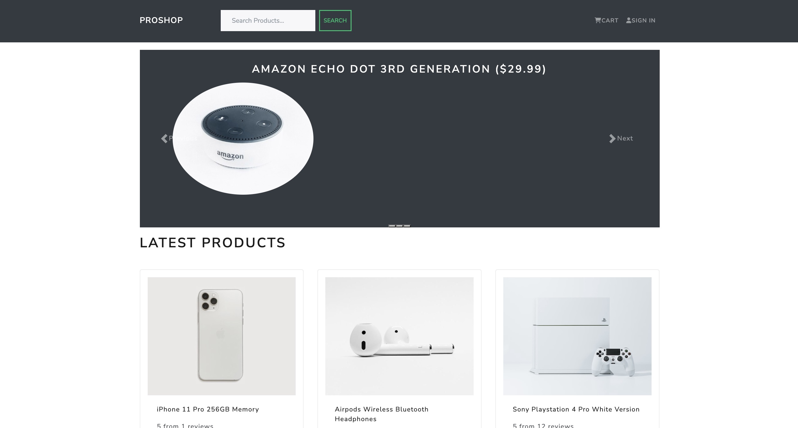
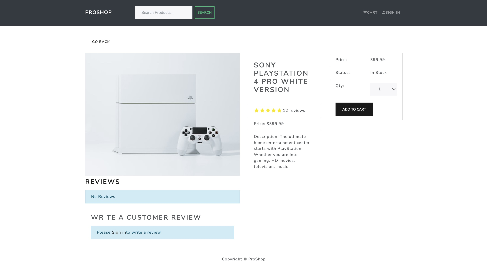

# MERN Proshop
> eCommerce platform built with the MERN stack & Redux.





This project is part of my [MERN Stack From Scratch | eCommerce Platform](https://www.traversymedia.com/mern-stack-from-scratch) course. It is a full-featured shopping cart with PayPal & credit/debit payments.

This is version 2.0 of the app, which uses Redux Toolkit.

## Table of Contents

- [Project Name](#project-name)
  - [Table of Contents](#table-of-contents)
  - [Usage](#usage)
  - [Features](#features)
  - [Requirements](#requirements)
    - [Env Variables](#env-variables)
    - [Install Dependencies (frontend \& backend)](#install-dependencies-frontend--backend)
    - [Run](#run)
    - [Build \& Deploy](#build--deploy)
    - [Seed Database](#seed-database)
    - [Roadmap](#roadmap)

## Usage

- Create a MongoDB database and obtain your `MongoDB URI` - [MongoDB Atlas](https://www.mongodb.com/cloud/atlas/register)
-


## Features

- Full featured shopping cart
- Product reviews and ratings
- Top products carousel
- Product pagination
- Product search feature
- User profile with orders
- Admin product management
- Admin user management
- Admin Order details page
- Mark orders as delivered option
- Checkout process (shipping, payment method, etc)
- PayPal / credit card integration
- Database seeder (products & users)

## Requirements

- Node 0.10.x
- Mongo Atlas account, and free-tier Cluster

### Env Variables

Rename the `.env.example` file to `.env` and add the following

```
NODE_ENV = development
PORT = 5000
MONGO_URI = your mongodb uri
JWT_SECRET = 'abc123'
PAYPAL_CLIENT_ID = your paypal client id
PAGINATION_LIMIT = 8

Change the JWT_SECRET and PAGINATION_LIMIT to what you want
```

### Install Dependencies (frontend & backend)

```
# from project directory
npm install
cd frontend
npm install
```

### Run

```
# Run frontend (:3000) & backend (:5001)
npm run dev
# Run backend only
npm run server
```

### Build & Deploy

```
# Create frontend prod build
cd frontend
npm run build
```

### Seed Database

You can use the following commands to seed the database with some sample users and products as well as destroy all data

```
# Import data
npm run data:import

# Destroy data
npm run data:destroy
```

### Roadmap

View the project roadmap [here](LINK_TO_PROJECT_ISSUES)

